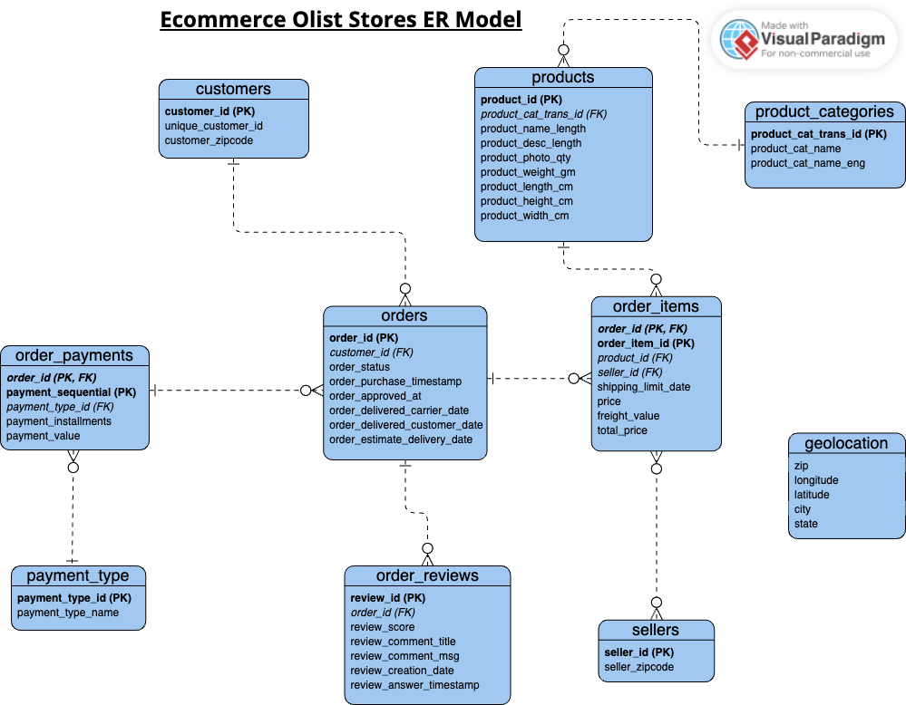

# Olist Ecommerce ETL Data Pipeline

## Overview

This project implements an ETL (Extract, Transform, Load) data pipeline for the Olist Ecommerce dataset. The pipeline extracts data from multiple CSV files, transforms it to meet specific requirements, and loads it into a PostgreSQL database. The project uses Pandas for data manipulation and SQLAlchemy for database operations.

## Dataset 

Kaggle: https://www.kaggle.com/datasets/olistbr/brazilian-ecommerce

## Prerequisites

- Python 3.x
- Pandas
- SQLAlchemy
- PostgreSQL

## Setup

1. **Clone the repository**:
    ```bash
    git clone https://github.com/yourusername/Olist_Ecommerce_ETL_Data_Pipeline.git
    cd Olist_Ecommerce_ETL_Data_Pipeline
    ```

2. **Install required packages**:
    ```bash
    pip install pandas sqlalchemy psycopg2-binary
    ```

3. **Configure PostgreSQL**:
    Ensure you have a PostgreSQL database set up. Update the `config.py` file with your database credentials:
    ```python
    # config.py
    DB_USER = 'your_db_user'
    DB_PASSWORD = 'your_db_password'
    DB_HOST = 'localhost'
    DB_PORT = '5432'
    DB_NAME = 'ecom_olist_stores_db'
    ```

## Running the Pipeline

1. **Extract, Transform, Load**:
    Run the `main.py` script to execute the entire ETL process:
    ```bash
    python main.py
    ```

## Data Modeling

The data from the Olist dataset is modeled into several tables in the PostgreSQL database. Below are the details:

### ER Diagram

The ER diagram for the data model:



## ETL Pipeline

### 1. Extraction of Data-

The extract_data function in extract.py loads data from CSV files into pandas DataFrames.

#### a. 'load_data' Function -
* Purpose: 
    This function reads a CSV file from the specified path and loads its contents into a pandas DataFrame.
* Parameters:
    file_path: It is a string representing the path to the CSV file.
* Returns:
    A pandas data frame that contains the data from the CSV file.
* Implementation: 
    It uses the pd.read_csv function from the pandas library to read the CSV file and return the resulting DataFrame.

#### b. 'extract_data' Function -
* Purpose: 
    This function loads multiple CSV files into a dictionary of pandas DataFrames.
* File Paths Definition:
    A dictionary file_paths is defined, where each key is a descriptive name for the dataset, and each value is the file path to the corresponding CSV file.
* Loading Data:
    It iterates over the file_paths dictionary, calling the load_data function for each file path.
    The resulting DataFrames are stored in a new dictionary data_frames, where each key is the same as in file_paths and each value is the corresponding DataFrame.
* Returns:
    The data_frames dictionary contains all loaded DataFrames.

### 2. Transform Data:
The transform_data function in transform.py performs the following transformations:

* Creating Directories:
Ensures the transformed_data directory exists.

* Transforming and Validating Data:
    * Customers Data:
        * Renames customer_zip_code_prefix to customer_zipcode.
        * Checks for missing values.
    * Order Items Data:
        * Adds a total_price column (sum of freight_value and price).
        * Checks for missing values and negative prices.
    * Orders Data:
        * Checks for duplicate order_id and valid order_status values.
    * Products and Product Categories Data:
        * Renames columns for consistency.
        * Merges with product categories, adding new categories.
        * Checks for duplicates and negative values.
    * Sellers Data:
        * Checks for missing values and duplicate seller_id.
    * Order Payments Data:
        * Maps payment_type to unique IDs.
        * Checks for missing values and negative payment values.
    * Order Reviews Data:
        * Validates review scores are between 1 and 5.
    * Saving Transformed Data:
        * Saves all transformed DataFrames as CSV files in the ```transformed_data/``` directory.

#### Error Handling
The script raises ValueError exceptions for the following conditions:

* Missing values in critical datasets.
* Negative values where not applicable.
* Duplicate IDs where uniqueness is required.
* Invalid values for categorical data.

### 3. Load the data into PostgreSQL -

The script performs the following steps:

#### a. Imports Required Libraries:
* ```'pandas'``` for reading CSV files.
* ```'sqlalchemy'``` for connecting to the PostgreSQL database.
* ```'config'``` for database configuration details.

#### b. Database Connection:
* Uses SQLAlchemy to create an engine for connecting to the PostgreSQL database using credentials from config.py.

#### c. Loading Transformed Data:
* Reads transformed data from CSV files into pandas DataFrames.

#### d. Inserting Data into PostgreSQL:
* Uses the to_sql method to insert data from each DataFrame into corresponding tables in the database.
* The if_exists='replace' parameter ensures that existing tables are replaced with the new data.

#### Key Functions
* create_engine: Establishes the connection to the PostgreSQL database.
* pd.read_csv: Loads data from CSV files into DataFrames.
* to_sql: Inserts DataFrames into the PostgreSQL database, replacing existing tables if they already exist.
